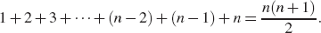

# Lab 16: Find The Missing Number

In this lab, we will design and implement algorithms to find the missing number in a list of numbers. The list contains _n − 1_ unique integers in the range _[1,n]_. That is, there is exactly one number from this range that is _not_ in the list.

For example, if _n_ is 5, the list may be given as:

    1 4 3 5

Your algorithm should then determine that the missing number is 2.

We will use different techniques to find the missing number and compare their efficiency.

# Part 1: Sorting Solution

In the function `findMissingNumberBySorting`, write an algorithm that sorts the sequence, then uses this fact to find the missing number. Make sure the corresponding test passes.

What are the time and space complexities of your implementation in terms of n?

# Part 2: Indexing Solution

In the function `findMissingNumberByIndexing`, write an algorithm that allocates a second array, then uses this array to find the missing number. Make sure the corresponding test passes.

What are the time and space complexities of your implementation in terms of n?

# Part 3: Gauss Solution

In the function `findMissingNumberByGauss`, write an algorithm that finds the missing number in _O(n)_ time and _O(1)_ space.

A hint comes from Chapter 4 in the textbook:

>In 1787, a German schoolteacher decided to keep his 9- and 10-year-old pupils occupied by adding up the integers from 1 to 100. But almost immediately one of the children claimed to have the answer! The teacher was suspicious, for the student had only the answer on his slate. But the answer was correct—5,050—and the student, Carl Gauss, grew up to be one of the greatest mathematicians of his time. It is widely suspected that young Gauss used the following identity.

> **Proposition 4.3**: For any integer n ≥ 1, we have:

